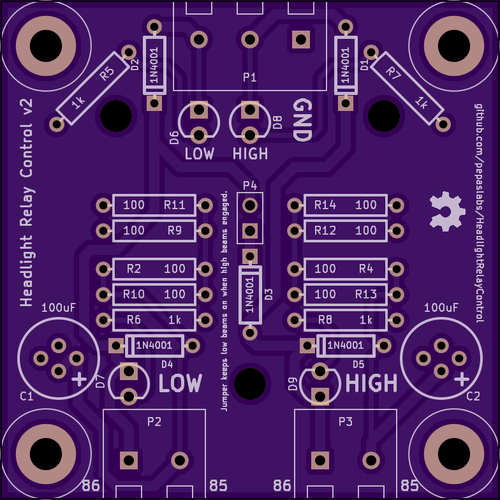
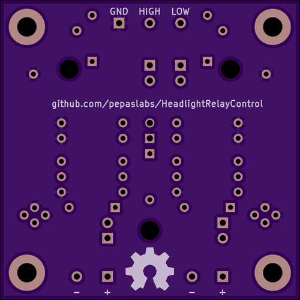

# HeadlightRelayControl

A circuit board to control automotive headlight [relays](http://en.wikipedia.org/wiki/Relay).

# Releases

## v2

### Gerbers

[gerbers.zip](releases/v2/gerbers.zip)

### Schematic

[PDF](releases/v2/HeadlightRelayControl_schematic.pdf).

# Designing this circuit in LTSpice

Let's design this circuit using [LTSpice](http://www.linear.com/ltspice).

Start with the following basic circuit.  The [inductor](http://en.wikipedia.org/wiki/Inductor) L1 represents the coil inside of the relay.

## Specifying the relay coil parameters

Before we can simulate this circuit, we need to know some characteristics of the relay coil.  Specifically, we need to know the [inducatance](http://en.wikipedia.org/wiki/Inductance) and the [resistance](http://en.wikipedia.org/wiki/Electrical_resistance_and_conductance).

Here I've measured the inductance of a typical 12 Volt, 30 Amp automotive relay to be about 132 millihenries (using a cheap [LC100-A](http://www.ebay.com/sch/i.html?_nkw=LC100-A) meter from eBay):

Here, I've pulled up the [datasheet](http://www.te.com/commerce/DocumentDelivery/DDEController?Action=srchrtrv&DocNm=1432785-1&DocType=Customer+Drawing&DocLang=English) of a similar relay [listed on digikey.com](http://www.digikey.com/product-detail/en/1432785-1/PB680-ND/807757), where the resistance is listed as being 90 Ohms:

Right-click on L1 and fill in these parameters:

We want to simulate turning this relay on.  We can do this by creating a **PULSE** voltage source which will switch from 0V to 12V at 10 milliseconds.  Right-click on V1, then click advanced and fill in these parameters:

Simulate the relay for 100 milliseconds

Click on the green **I(L1)** label to create a cursor.  We can use the cursor to meausre the current, which is 133mA:

## Optimization: PICK and HOLD current

If you've ever operated an automotive relay at full voltage for a long period of time, you know they can get pretty hot.

It turns out that isn't necessary.  A relay only needs a short burst of full voltage (actually, current) to get the armature moving (this is called the **PICK** current).  Once switched, it requires only a fraction of that current (typically less than half of **PICK**) to keep the relay on (the **HOLD** current).

### Current-limiting resistor

We can add a 100 Ohm current-limiting resistor after the relay coil:

Now we have our **HOLD** current (63mA), but we've lost our **PICK** current.  This means our relay might not turn on reliably.

How can we have both a **PICK** and a **HOLD** current?  There are a few ways to implement this optimization.

### PWM the coil

We could [PWM](http://en.wikipedia.org/wiki/Pulse-width_modulation) the coil, perhaps using a purpose-built [IC](http://en.wikipedia.org/wiki/Integrated_circuit), such as the [DRV120](http://www.ti.com/lit/ds/symlink/drv120.pdf) made by [TI](http://www.ti.com/).

However, there even simpler, more hobbyist-friendly solutions...

### Bypass the current-limiting resistor

The technique I decided to use was to bypass the current-limiting resistor with a capacitor.

I came across this trick in a [blog post](http://jumperone.com/2011/10/using-relays/) by [Phil Levchenko](http://jumperone.com/about/).  Be sure to also check out his [YouTube channel](https://www.youtube.com/user/JumperOneTV).

First we will try a 10uF capacitor.  We will esitmate its [ESR](http://en.wikipedia.org/wiki/Equivalent_series_resistance) to be 1 Ohm.

Also, shorten the simulation window to just 50 milliseconds:

It worked!  We have both a **PICK** and a **HOLD** current.

However, our **PICK** current is small and not very long in duration, so a 10uF capacitor might not be enough to give us reliable relay operation.

Based on the [datasheet](http://www.te.com/commerce/DocumentDelivery/DDEController?Action=srchrtrv&DocNm=1432785-1&DocType=Customer+Drawing&DocLang=English) mentioned above, we should shoot for a **PICK** current window of around 8 milliseconds in duration, and we want it to be much closer to 133mA.

Next we'll try a 100uF capacitor.  Estimate the ESR to be 100 milliohms.

That's a lot closer to what we want.  Use a cursor to get a more exact idea of what our 8ms **PICK** window looks like.

Just to be thorough, we should also try a larger capacitor.  Try a 220uF (with 100mOhm ESR):

It looks like either 100uF or 200uF would work well.

When designing a circuit, you'll often find yourself in these "[Goldilocks](http://en.wikipedia.org/wiki/The_Story_of_the_Three_Bears)" scenarios, trying to find the value that's "just right".  Its a good idea to get better at this, so that you can iterate on a design faster.

The quick-n-dirty way to do this is to triplicate your circuit and simulate all three at once.

Eventually though, you'll want to learn how to [step the parameters of your simulations](http://www.linear.com/solutions/1089).

## Freewheeling diode

What happens when we switch the relay off?

Anytime you interrupt current flowing through an inductor, it creates a (negative) voltage spike, a.k.a an [inductive "kickback"](http://www.coilgun.info/theoryinductors/inductivekickback.htm) as the magnetic field in the inductor collapses.  This spike can can reach dozens, hundreds, or even thousands of Volts, which can damage other components in your circuit.

### Simulating inductive kickback

Does our circuit suffer from inductive kickback?  Let's ask LTSpice!

In order to simulate that, we need to use a switch, which is slightly complicated in LTSpice.

#### Wait, why can't we just turn the PULSE source off at, say, 40 milliseconds?

That would set the **PULSE** source to 0 Volts.  It turns out that's not the same thing as turning the circuit off (see also [Three-state logic](http://en.wikipedia.org/wiki/Three-state_logic)).

When we set a voltage source to 0 Volts, it **actively drives** the circuit to 0 Volts.  That's not the same thing as just disconnecting the voltage source.  That's more like replacing the voltage source with a short-circuit (to ground).

#### Using a switch in LTSpice

Grab [switch.mod](https://github.com/pepaslabs/LTSpice-parts/tree/master/parts/switch) and follow [my tutorial](https://github.com/pepaslabs/LTSpice-parts/wiki/switch) on how to incorporate it into a circuit.

Modify your circuit so that the switch is connected to the inductor:

Reconfigure the **PULSE** source to have a **Von** of 1 Volt and a **Ton** of 50 milliseconds:

Widen the simulation window to 100 milliseconds:

Run the simulation and probe the voltage between the switch and the inductor.

Houston, we have a problem (inductive kickback!):

(Note that with real-world components, you won't actually reach -600,000 Volts.  That only happens with idealized components in a simulator.).

Measuring the current through L1 gives you a better idea of what is going on here.  We are trying to instantaneously stop the current through the inductor, which causes the negative spike.

### So how do we get rid of the inductive kickback?

Inductive kickback is typically mitigated by placing a [freewheeling diode](http://en.wikipedia.org/wiki/Flyback_diode) (also called a flyback diode or snubber diode) across the inductor.  The negative spike is dissipated through the diode, which "clamps" the spike to no more than the [forward voltage drop](https://learn.sparkfun.com/tutorials/diodes/real-diode-characteristics) across the diode (typically 0.65 Volts).

Place a diode across the inductor.  Right-click on the diode and make it a [1N4148](http://en.wikipedia.org/wiki/1N4148).

Did it fix our negative voltage spike?

Yup!

(Notice the funny blip where the decaying voltage suddenly jumps back up a bit.  Note also that it jumps up by exactly 1 forward diode drop, at exactly the point when current finishes decaying in the inductor.)

## Feature: When you turn on the high-beams, keep the low-beams on

This control board has a feature where the low beams stay on when the high-beams are engaged.  This was implemented using a [diode OR](http://en.wikipedia.org/wiki/Diode-or_circuit).

Before we can simulate this feature, we need to duplicate our relay control circuit (to simulate both low beam and high beam), and put in an incomplete diode OR circuit (which we will complete later).

### Setup low beam and high beam circuits

Make a copy of the relay coil control circuit:

Setup two switches:

Create the (incomplete) diode OR:

The complete circuit should look like this:

Reconfigure the **PULSE** sources so that low beams turn on at 10 milliseconds for a duration of 20 milliseconds, and high beams turn on at 20 milliseconds for a duration of 20 milliseconds.  This will set up the following events:
* at T=10ms, low beams will turn on
* at T=20ms, high beams will turn on
* at T=30ms, low beams will turn off
* at T=40ms, high beams will turn off

Now, add the missing piece.  Complete the diode OR with an additional 1N4148:

Run the simulation again.  If the diode OR works, you should see the high beams prevent the low beams from turning off.

Bingo!

### Investigating a glitch

However, notice that the **HOLD** current through the low beam relay coil dips a bit at the point in time where the low beams are being held on by the high beams (when LB_power shuts off).

In our particular case, this dip isn't large enough for us to worry about (such a small dip won't cause the relay to turn off).

But let's examine what causes this anyway.  Create two additional traces which monitor LB_control and HB_control:

Ah, now this makes sense.  When LB_power shuts off, the current which keeps the low beam relay on has to go through D4 and then through D5.  This means it suffers a second diode drop (another 0.65 Volts) before it reaches the low beam coil.  That's what accounts for the slight dip in coil current.

### Consider power dissipation

This also means that when the high beams are keeping the low beams on, the current for both relay coils has to go through D4.  Let's take a moment to examine the power dissipation in D3, D4, and D5.  Hold down ALT and click on the diodes to create power dissipation traces.

The result is a bit confusing, because there are infinitesimally breif moments where the current spikes up over 100 Amps, which throws off the scale of the plot.  (We can safely ignore these spikes, as our real-world components will have parasitic capacitance and inductance which will greatly tame these spikes.  What remains will be so brief that it will be safely absorbed by the thermal mass of the diode).

Use the zoom tool to bring the situation to light:

Now we have a better picture of what's going on.  These power dissipation figures are all below a 1/4 Watt.  When we build our board, we should probably upgrade the 1N4148 diodes to some 1N4001's.  (In fact, in order to keep our parts order simple, we will end up using 1N4001 for every diode in the circuit).

# Prototype

Now that we're reasonably sure our design is sound, the next step is to make a prototype.

I prefer to use [Manhattan style](https://www.google.com/search?q=manhattan+style+prototyping) construction on [copper clad](http://www.ebay.com/sch/i.html?_nkw=copper+clad).

Note that I used terminal blocks to hold the bypass capacitors, so that I could easy swap them out and try different values of capacitance.

# See also:

* http://electronics.stackexchange.com/questions/34561/what-are-some-ways-to-use-relays-more-efficiently

# Background: The need for this circuit

## Why did I make this circuit?

After upgrading the aging, dim headlights on my (1997 Dodge Ram) pickup truck with an HID headlight kit from eBay, I ran into a problem: the stock headlight switch couldn't handle the higher current load of the HID headlights.

The spade connector on the headlight switch got so hot that the plastic which holds it in place started to melt.  Some of the melted plastic interfered with the connection, and the connector was no longer being securely held in place.  The result was that you had to wiggle the switch to get the headlights to come, and you could occaisionally smell burning plastic.  Eventually, the connection stopped working entirely.

## Why did the stock headlight switch fail?  Its hard to beleive the HIDs drew THAT MUCH more current...

True, there's more to this story than a simple matter of higher current draw.

Stock halogen headlights are spec'ed at 55 Watts.  If we assume that spec is for 12 Volts (rather than the 14.2 Volts you'd find in a running car), that means each lamp is drawing 55 / 12 = roughly 4.6 Amps.

The HID ballasts I use claim a max current draw of 10 Amps (they don't always draw 10 Amps, but they can go that high).  That's potentially more than twice the current which the stock headlight switch and wiring were designed around.

### HID ballasts look like a constant-wattage load

However, this problem is compounded by the fact that the HID ballasts are basically a constant-current supply, which means they look like a constant-wattage load to your car's electrical system.  This means that if you try to feed the ballast a lower voltage, it will simply draw more current to make up for it.  That's why they stay the same brightness even if your voltage droops a bit.

Resistive loads (like a traditional halogen bulb) don't behave like this.  If you lower the voltage, they draw fewer amps (and get dimmer).  If I had put 100 watt halogen bulbs in my truck, that would be bad (because they would try to draw 100 / 12 = 8.3 Amps), but it wouldn't be as precarious as the situation created by the HID ballasts.  Here's why:

When we turn on the 100 Watt halogen bulbs, they would draw 8.3 Amps.  The headlight switch (particularly the spade connector) and the wiring would start to heat up because we are drawing more current than they were rated for.  As they heat up, and their resistance would increase, which would create a voltage drop.  So now your bulbs only see maybe 10 Volts.  This means they draw less current, which means the headlight switch and wiring could start to cool down a bit, and eventually the whole system would settle out at some equilibrium.  This is how linear, resistive loads work.

### Thermal runaway

HID ballasts don't work like that.  The ballasts say their max draw is 10 Amps, but let's assume their normal, 12 Volt draw is only 6 Amps (72 Watts).  What happens when we turn them on?  Initially, the headlight switch and wiring aren't hot, and their resistance is low, and the HID ballast sees pretty close to 12 Volts, and draws 6 Amps.  But even 6 Amps is more than what the stock switch and wiring was designed to handle, so they start heating up, increasing in resistance, and creating a Voltage drop.  The HID ballasts are now only seeing 10 volts, and they compensate by increasing their current draw to 7.2 Amps (still 72 Watts).  This increased current draw causes the switch and wiring to heat up even more, become more resistive, and create an even bigger drop.  The ballast now sees only 8 Volts, and responds by drawing 9 Amps (still 72 Watts).  And now the switch and wiring heat up even more, and so on, and so on...

This situation is referred to as "thermal runaway".  The process would keep going indefinitely, except that the HID ballasts are designed with a safety mechanism where they will refuse to draw more than 10 Amps.  But at that point, the headlight switch and wiring are already hot enough to start burning the plastic and damaging the switch.

### Solution: use relays!

The solution to all of this is to use relays, which are high-current switches which are operated by a small current.  Typical automotive relays are rated to handle 30 Amps (more than enough for our HID ballasts) and they are typically controlled by about 0.125 Amps (125 milliamps).  This looks like a tiny, tiny load to your headlight switch, which means it won't even get warm, let alone hot enough to self-destruct.
